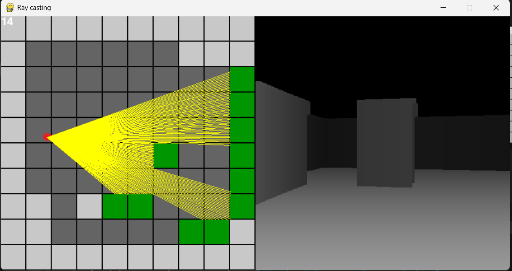
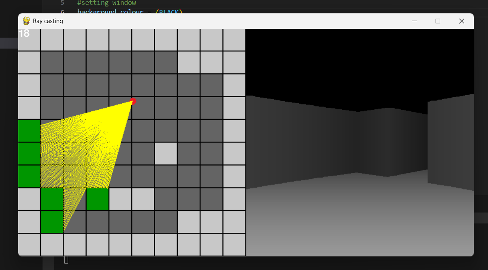

# Ray Tracing Engine?
Revisiting old projects and adding a readme file for a better github profile.

## Description

Created this project 2 years ago, I dont remember how it works but here is my explaination:

It works by projecting a "ray" of certain depth, for each ray and for each of its depth unit we check for collision with a surface. The further the depth of the ray gets before collision, the farther away the object it. Color gradient of the object is assigned accordingly to give sense of depth perception.

Press arrow keys for movement.


## Installation

Clone and install pygame or requirments.txt

## Usage

Instructions on how to use the project, including example commands:

```sh
python main.py  # or relevant execution command
```

## Images

